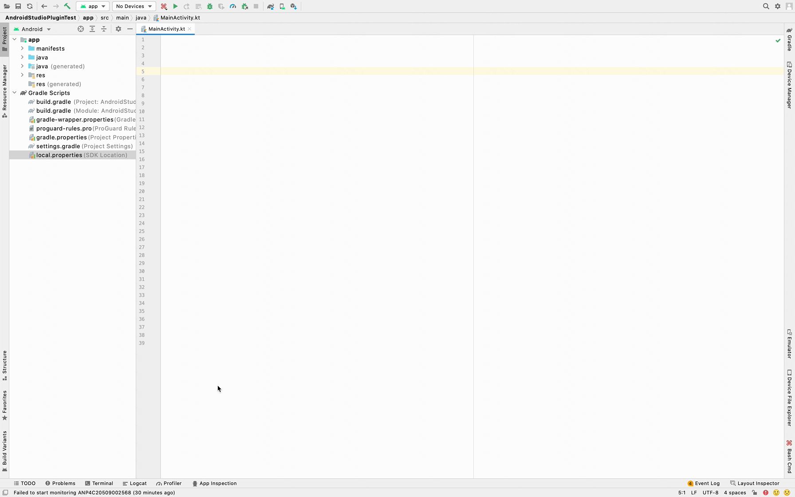

[中文](https://github.com/ljg-7f/BashCmd/blob/main/README_CN.md)

## 1. Introduction

* Bash Cmd is to visualize the commands executed in the terminal on the development tool interface, such as Android Studio, Intellij Idea, etc.
* Bash Cmd can display two styles of visual interface on the **main toolbar** and **right sidebar** by configuring the corresponding files in the project.
* The configuration files of Bash Cmd can be divided into two modes: **team** and **personal**, which meets the needs of unified public configuration and differentiated personal configuration.

## 2. Interface display

|    describe    |                     display                     |
|:--------------:|:--------------------------------------------------:|
|  main toolbar  |      |
| right sidebar  |  |
| dynamic effect |     |

## 3. Configuration file description

You can refer to the files in the `bash_cmd_plugin` directory in this project. 

If you install the Bash Cmd plugin first, and then create the `bash_cmd_plugin` directory configuration file, 
you need to restart the development tool to display the Bash Cmd button.
If the `bash_cmd_plugin` directory configuration file is created first, and then the Bash Cmd plugin is installed, 
the Bash Cmd button can be displayed without restarting.

Bash Cmd description map:


### 3.1 Configuration file directory structure

Create a `bash_cmd_plugin` directory in the root directory of the project.

|— root directory<br>
|— bash_cmd_plugin<br>
|&nbsp;&nbsp;&nbsp;&nbsp;&nbsp;&nbsp;&nbsp;&nbsp;&nbsp; |— common<br>
|&nbsp;&nbsp;&nbsp;&nbsp;&nbsp;&nbsp;&nbsp;&nbsp;&nbsp; | &nbsp;&nbsp;&nbsp;&nbsp;&nbsp; |—
bash_cmd_tool_window.json<br>
|&nbsp;&nbsp;&nbsp;&nbsp;&nbsp;&nbsp;&nbsp;&nbsp;&nbsp; | &nbsp;&nbsp;&nbsp;&nbsp;&nbsp; |— bash_cmd_toolbar.json<br>
|&nbsp;&nbsp;&nbsp;&nbsp;&nbsp;&nbsp;&nbsp;&nbsp;&nbsp; |— personal<br>
|&nbsp;&nbsp;&nbsp;&nbsp;&nbsp;&nbsp;&nbsp;&nbsp;&nbsp; | &nbsp;&nbsp;&nbsp;&nbsp;&nbsp; |—
bash_cmd_tool_window.json<br>
|&nbsp;&nbsp;&nbsp;&nbsp;&nbsp;&nbsp;&nbsp;&nbsp;&nbsp; | &nbsp;&nbsp;&nbsp;&nbsp;&nbsp; |— bash_cmd_toolbar.json<br>
|&nbsp;&nbsp;&nbsp;&nbsp;&nbsp;&nbsp;&nbsp;&nbsp;&nbsp; |— icons<br>
|&nbsp;&nbsp;&nbsp;&nbsp;&nbsp;&nbsp;&nbsp;&nbsp;&nbsp; |— shell<br>

Among them, the `common` directory places public configuration files; the `personal` directory places personal configuration files, **this directory needs to be declared in the `.gitignore` file**.
The `icons` directory is used to place the icons used in the visual interface. It is not necessary to create them. The plugin will provide the default icons.
The `shell` directory houses executable files.

### 3.2 Configuration file example

`bash_cmd_tool_window.json` is used to configure the **right sidebar** interface, the format is as follows:

```
{
    "name": "Bash Cmd", // optional
    "icon": "/META-INF/icons/bash_cmd.svg", // optional
    "commands":
    [
        {
            "name": "adb version",
            "cmd": "adb --version"
        },
        {
            "name": "run local bash",
            "cmd": "sh #projectPath#/bash_cmd_plugin/shell/run_local_bash.sh",
            "icon": "#projectPath#/bash_cmd_plugin/icons/run_1.svg" // optional
        },
        {
            "name": "update resource style_1",
            "children":
            [
                {
                    "name": "color",
                    "desc": "update color", // optional
                    "cmd": "echo updating && echo waiting... && sleep 5",
                    "finishTip": "update color finished." // optional
                },
                {
                    "name": "icon",
                    "desc": "update icon", // optional
                    "cmd": "echo updating && echo waiting... && sleep 5"
                },
                {
                    "name": "font",
                    "desc": "update font", // optional
                    "cmd": "echo updating && echo waiting... && sleep 5"
                }
            ]
        },
        {
            "isPopupMode": true,
            "name": "update resource style_2",
            "children":
            [
                {
                    "name": "color",
                    "desc": "update color", // optional
                    "cmd": "echo updating && echo waiting... && sleep 5"
                },
                {
                    "name": "icon",
                    "desc": "update icon", // optional
                    "cmd": "echo updating && echo waiting... && sleep 5"
                },
                {
                    "name": "font",
                    "desc": "update font", // optional
                    "cmd": "echo updating && echo waiting... && sleep 5"
                }
            ]
        }
    ]
}
```

`bash_cmd_toolbar.json` is used to configure the **main toolbar** interface, the format is as follows:

```
{
    "name": "Bash Cmd", // optional
    "icon": "/META-INF/icons/bash_cmd.svg", // optional
    "commands":
    [
        {
            "name": "adb version",
            "cmd": "adb --version",
            "shortcut": "ctrl meta alt A" // optional
        },
        {
            "name": "run local bash",
            "cmd": "sh #projectPath#/bash_cmd_plugin/shell/run_local_bash.sh",
            "icon": "#projectPath#/bash_cmd_plugin/icons/run_1.svg" // optional
        },
        {
            "isSeparator": true
        },
        {
            "name": "update resource",
            "children":
            [
                {
                    "name": "color",
                    "desc": "update color", // optional
                    "cmd": "echo updating && echo waiting... && sleep 5",
                    "finishTip": "update color finished." // optional
                },
                {
                    "isSeparator": true
                },
                {
                    "name": "icon",
                    "desc": "update icon", // optional
                    "cmd": "echo updating && echo waiting... && sleep 5"
                },
                {
                    "isSeparator": true
                },
                {
                    "name": "font",
                    "desc": "update font", // optional
                    "cmd": "echo updating && echo waiting... && sleep 5"
                }
            ]
        }
    ]
}
```

The top-level `name` and `icon` in `bash_cmd_tool_window.json` and `bash_cmd_toolbar.json` can be omitted, the plugin will provide default `name` and `icon`. Just define `commands`
That's it. `icon` in `commands` can also be omitted, `desc` in `commands` is the title of the run panel, if omitted, `name` is used as the title.
`finishTip` If set, a prompt bubble will pop up in the lower right corner after the command is successfully executed.
(It will disappear automatically after 10 seconds. You can choose No popup or Sticky balloon mode in Notifications settings, you can also set Log, Play sound, Read aloud switch).

> Note: **#projectPath#** in the configuration file is a specific field that represents the root path of the project.

### 3.3 Differences between `bash_cmd_tool_window.json` and `bash_cmd_toolbar.json`

* `bash_cmd_tool_window.json` has `{ "isPopupMode": true }` mode. After clicking the mode item, a popup window will be displayed to display the content of `children`, but `bash_cmd_toolbar.json` does not have it.
* `bash_cmd_toolbar.json` needs to add its own dividing line `{ "isSeparator": true }`, but not in `bash_cmd_tool_window.json`.
* Shortcut keys can be configured in `bash_cmd_toolbar.json`, such as: `"shortcut": "ctrl meta alt A"`, but not in `bash_cmd_tool_window.json`.

> Recommendation: If the configuration command is relatively simple, you can only configure the main toolbar interface of `bash_cmd_toolbar.json`. If there are many types of commands, it is recommended to configure the right sidebar interface of `bash_cmd_tool_window.json`.
> Of course a combination of the two is also possible.

### 3.4 Rules for merging `common` and `personal`

* The top-level `name` and `icon` in `bash_cmd_tool_window.json` and `bash_cmd_toolbar.json` are dominated by `personal`.
* `commands` of `personal` will be appended to `commands` of `common`.

### 3.5 Icon configuration rules

Three configuration forms of icon:

1. Use the local icon, the icon must be in svg format, which needs to satisfy: `icon.endsWith(".svg")`. <br> Such as: `"icon": "#projectPath#/bash_cmd_plugin/icons/run_1.svg"`
2. To use the icon provided by Intellij Idea, you need to satisfy: `icon.startsWith("AllIcons.")`. <br> Such as: `"icon": "AllIcons.Actions.Refresh"`. Intellij
   Idea
   The provided icons can be referred to: [AllIcons](https://github.com/JetBrains/intellij-community/blob/master/platform/util/src/com/intellij/icons/AllIcons.java
   )
3. To use the icon provided by this plugin, you need to satisfy: `icon.startsWith("/META-INF/icons/")`. <br> For example: `"icon": "/META-INF/icons/bash_cmd.svg"`. The icons provided in the plugin are as follows:

|       name       |                         icon                          |
|:----------------:|:-----------------------------------------------------:|
| **bash_cmd.svg** |    |
|   clean_1.svg    |     |
|   clean_2.svg    |     |
|    close.svg     |       |
|  generate_1.svg  |  |
|  generate_2.svg  |  |
|   install.svg    |     |
|   **more.svg**   |        |
|    proxy.svg     |       |
|   refresh.svg    |     |
|   **run.svg**    |         |
|    run_1.svg     |       |
|    run_2.svg     |       |
|     stop.svg     |        |
|    update.svg    |      |

Among them, bash_cmd.svg, more.svg, run.svg are the default icons in some scenarios.

### 3.6 Cmd instruction description

cmd is a string of commands concatenated (supports the ; || && operator). Make sure that the commands in the string can be executed normally in the terminal. If a project path is used, `#projectPath#` needs to be used instead.
For example: `"cmd": "sh #projectPath#/bash_cmd_plugin/shell/run_local_bash.sh"`

### 3.7 How to take effect after modifying the configuration file

* `bash_cmd_toolbar.json` main toolbar interface, click the internal command `refresh command list` to trigger the refresh logic
* Click the refresh button on the right sidebar interface of `bash_cmd_tool_window.json` to trigger the refresh logic.

