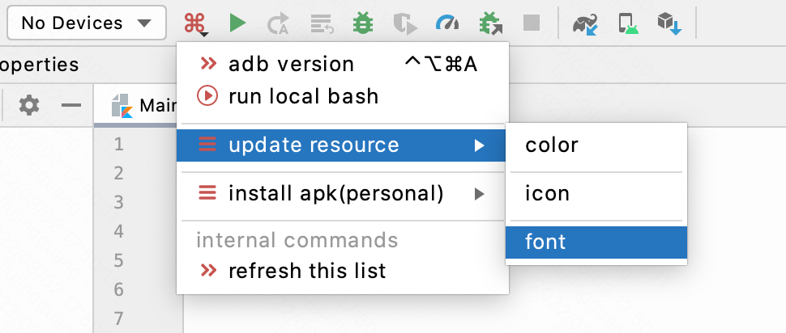
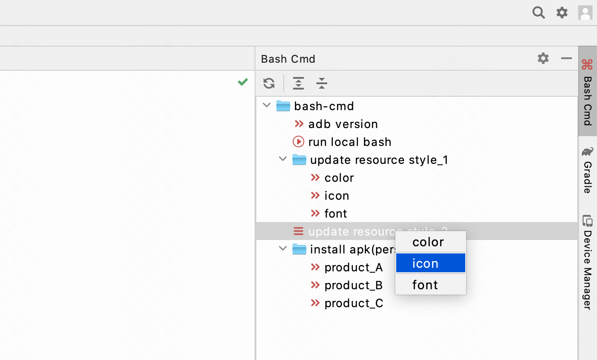
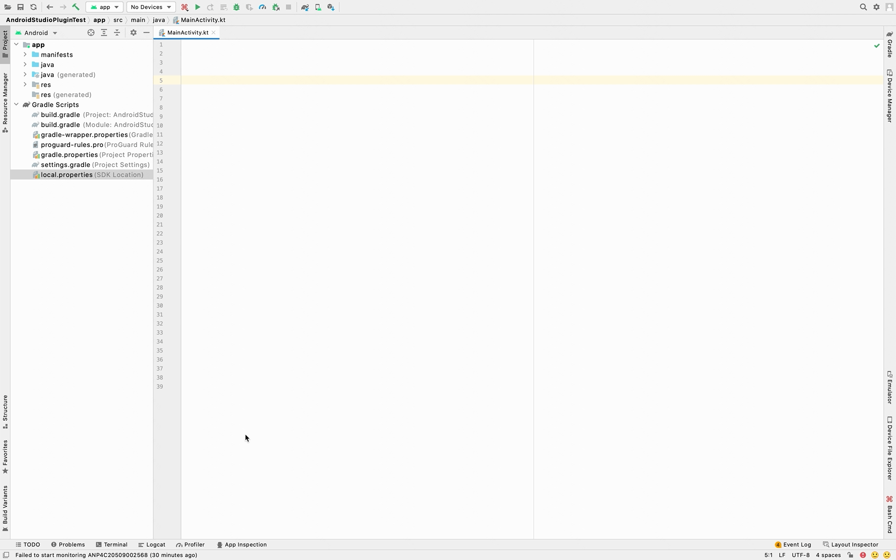
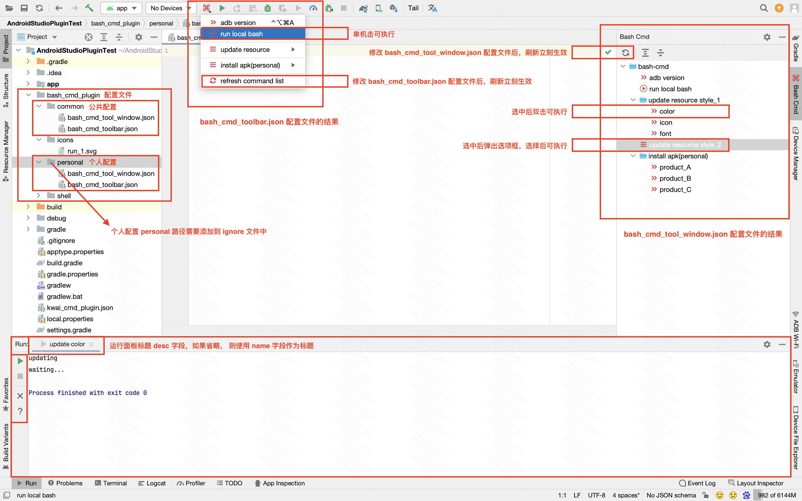

## 1. 简介

* Bash Cmd 是将在终端执行的命令在开发工具界面上可视化，开发工具如：Android Studio、Intellij Idea等。
* Bash Cmd 通过在项目中配置相应的文件，可在**主工具栏**和**右侧边栏**上展示两种样式的可视化界面。
* Bash Cmd 的配置文件可分为**团队**和**个人**两种模式，满足了公共配置统一化和个人配置差异化的需要。

## 2. 界面展示

|  描述  |                         展示                         |
|:----:|:--------------------------------------------------:|
| 主工具栏 |      |
| 右侧边栏 |  |
| 动态效果 |     |

## 3. 配置文件说明

可参考本工程中`bash_cmd_plugin`目录里的文件。

如果先安装上了Bash Cmd插件，再创建`bash_cmd_plugin`目录配置文件，那么需要重启开发工具才能将Bash Cmd按钮展现出来。
如果先创建了`bash_cmd_plugin`目录配置文件，再安装Bash Cmd插件，那么不需要重新启动Bash Cmd按钮就可以展现。

Bash Cmd 说明图：



### 3.1 配置文件目录结构

在项目的根目录中创建`bash_cmd_plugin`目录。

|— 根目录<br>
|— bash_cmd_plugin<br>
|&nbsp;&nbsp;&nbsp;&nbsp;&nbsp;&nbsp;&nbsp;&nbsp;&nbsp; |— common<br>
|&nbsp;&nbsp;&nbsp;&nbsp;&nbsp;&nbsp;&nbsp;&nbsp;&nbsp; | &nbsp;&nbsp;&nbsp;&nbsp;&nbsp; |—
bash_cmd_tool_window.json<br>
|&nbsp;&nbsp;&nbsp;&nbsp;&nbsp;&nbsp;&nbsp;&nbsp;&nbsp; | &nbsp;&nbsp;&nbsp;&nbsp;&nbsp; |— bash_cmd_toolbar.json<br>
|&nbsp;&nbsp;&nbsp;&nbsp;&nbsp;&nbsp;&nbsp;&nbsp;&nbsp; |— personal<br>
|&nbsp;&nbsp;&nbsp;&nbsp;&nbsp;&nbsp;&nbsp;&nbsp;&nbsp; | &nbsp;&nbsp;&nbsp;&nbsp;&nbsp; |—
bash_cmd_tool_window.json<br>
|&nbsp;&nbsp;&nbsp;&nbsp;&nbsp;&nbsp;&nbsp;&nbsp;&nbsp; | &nbsp;&nbsp;&nbsp;&nbsp;&nbsp; |— bash_cmd_toolbar.json<br>
|&nbsp;&nbsp;&nbsp;&nbsp;&nbsp;&nbsp;&nbsp;&nbsp;&nbsp; |— icons<br>
|&nbsp;&nbsp;&nbsp;&nbsp;&nbsp;&nbsp;&nbsp;&nbsp;&nbsp; |— shell<br>

其中，`common`目录放置公共配置文件；`personal`目录放置个人配置文件，**该目录需要在`.gitignore`文件中声明**。
`icons`目录放置可视化界面中使用到的icon，可以不创建，插件会提供默认的icon。
`shell`目录放置可执行的文件。

### 3.2 配置文件实例

`bash_cmd_tool_window.json`用于配置**右侧边栏**界面，格式如下：

```
{
    "name": "Bash Cmd", // 可省略
    "icon": "/META-INF/icons/bash_cmd.svg", // 可省略
    "commands":
    [
        {
            "name": "adb version",
            "cmd": "adb --version"
        },
        {
            "name": "run local bash",
            "cmd": "sh #projectPath#/bash_cmd_plugin/shell/run_local_bash.sh",
            "icon": "#projectPath#/bash_cmd_plugin/icons/run_1.svg" // 可省略
        },
        {
            "name": "update resource style_1",
            "children":
            [
                {
                    "name": "color",
                    "desc": "update color", // 可省略
                    "cmd": "echo updating && echo waiting... && sleep 5",
                    "finishTip": "update color finished." // 可省略
                },
                {
                    "name": "icon",
                    "desc": "update icon", // 可省略
                    "cmd": "echo updating && echo waiting... && sleep 5"
                },
                {
                    "name": "font",
                    "desc": "update font", // 可省略
                    "cmd": "echo updating && echo waiting... && sleep 5"
                }
            ]
        },
        {
            "isPopupMode": true,
            "name": "update resource style_2",
            "children":
            [
                {
                    "name": "color",
                    "desc": "update color", // 可省略
                    "cmd": "echo updating && echo waiting... && sleep 5"
                },
                {
                    "name": "icon",
                    "desc": "update icon", // 可省略
                    "cmd": "echo updating && echo waiting... && sleep 5"
                },
                {
                    "name": "font",
                    "desc": "update font", // 可省略
                    "cmd": "echo updating && echo waiting... && sleep 5"
                }
            ]
        }
    ]
}
```

`bash_cmd_toolbar.json`用于配置**主工具栏**界面，格式如下：

```
{
    "name": "Bash Cmd", // 可省略
    "icon": "/META-INF/icons/bash_cmd.svg", // 可省略
    "commands":
    [
        {
            "name": "adb version",
            "cmd": "adb --version",
            "shortcut": "ctrl meta alt A" // 可省略
        },
        {
            "name": "run local bash",
            "cmd": "sh #projectPath#/bash_cmd_plugin/shell/run_local_bash.sh",
            "icon": "#projectPath#/bash_cmd_plugin/icons/run_1.svg" // 可省略
        },
        {
            "isSeparator": true
        },
        {
            "name": "update resource",
            "children":
            [
                {
                    "name": "color",
                    "desc": "update color", // 可省略
                    "cmd": "echo updating && echo waiting... && sleep 5",
                    "finishTip": "update color finished." // 可省略
                },
                {
                    "isSeparator": true
                },
                {
                    "name": "icon",
                    "desc": "update icon", // 可省略
                    "cmd": "echo updating && echo waiting... && sleep 5"
                },
                {
                    "isSeparator": true
                },
                {
                    "name": "font",
                    "desc": "update font", // 可省略
                    "cmd": "echo updating && echo waiting... && sleep 5"
                }
            ]
        }
    ]
}
```

`bash_cmd_tool_window.json`和`bash_cmd_toolbar.json`中顶层的`name`和`icon`可以省略，插件会提供默认的`name`和`icon`。 只需要定义`commands`
即可。`commands`中的`icon`也可以省略，`commands`中的`desc`是运行面板的标题，如果省略， 则使用`name`作为标题。
`finishTip`如果设置，则在命令成功执行完成后，会在右下角弹出提示气泡
（10秒后自动消失。可以在 Notifications 设置中选择 No popup 或 Sticky balloon 模式，也可以设置 Log、Play sound、Read aloud 开关）。

> 注意： 配置文件中的 **#projectPath#** 是特定的字段，代表项目的根路径。

### 3.3 `bash_cmd_tool_window.json`和`bash_cmd_toolbar.json`的差异

* `bash_cmd_tool_window.json`有`{ "isPopupMode": true }`模式，点击该模式项后会展现弹窗来展示其中的`children`内容，而`bash_cmd_toolbar.json`中没有。
* `bash_cmd_toolbar.json`需要自己添加分割线`{ "isSeparator": true }`，而`bash_cmd_tool_window.json`中不需要。
* `bash_cmd_toolbar.json`中可以配置快捷键，如：`"shortcut": "ctrl meta alt A"`，`bash_cmd_tool_window.json`中不可以。

> 建议：如果配置的指令比较简单可以只配置`bash_cmd_toolbar.json`主工具栏界面，如果指令种类比较多，推荐配置`bash_cmd_tool_window.json`右侧边栏界面，
> 当然也可以两者结合使用。

### 3.4 `common`和`personal`合并的规则

* `bash_cmd_tool_window.json`和`bash_cmd_toolbar.json`中顶层的`name`和`icon`以`personal`为主。
* `personal`的`commands`会被追加到`common`的`commands`中。

### 3.5 icon的配置规则

icon的三种配置形式：

1. 使用本地的icon，icon必须是svg格式，需要满足：`icon.endsWith(".svg")`。<br> 如：`"icon": "#projectPath#/bash_cmd_plugin/icons/run_1.svg"`
2. 使用 Intellij Idea 所提供的icon，需要满足：`icon.startsWith("AllIcons.")`。<br> 如：`"icon": "AllIcons.Actions.Refresh"`。 Intellij
   Idea
   提供的icon可参考：[AllIcons](https://github.com/JetBrains/intellij-community/blob/master/platform/util/src/com/intellij/icons/AllIcons.java
   )
3. 使用本插件提供的icon，需要满足：`icon.startsWith("/META-INF/icons/")`。<br> 如：`"icon": "/META-INF/icons/bash_cmd.svg"`。插件中提供的icon如下：

|       name       |                         icon                          |
|:----------------:|:-----------------------------------------------------:|
| **bash_cmd.svg** |    |
|   clean_1.svg    |     |
|   clean_2.svg    |     |
|    close.svg     |       |
|  generate_1.svg  |  |
|  generate_2.svg  |  |
|   install.svg    |     |
|   **more.svg**   |        |
|    proxy.svg     |       |
|   refresh.svg    |     |
|   **run.svg**    |         |
|    run_1.svg     |       |
|    run_2.svg     |       |
|     stop.svg     |        |
|    update.svg    |      |

其中，bash_cmd.svg、more.svg、run.svg 是一些场景中的默认icon。

### 3.6 cmd指令说明

cmd是一串指令拼接的字符串（支持 ; || && 操作符），要确保该字符串中的命令能够在终端正常执行。如果用到项目路径，需要使用`#projectPath#`代替。
如：`"cmd": "sh #projectPath#/bash_cmd_plugin/shell/run_local_bash.sh"`

### 3.7 修改配置文件后如何生效

* `bash_cmd_toolbar.json`主工具栏界面，点击内部指令`refresh command list`触发刷新逻辑
* `bash_cmd_tool_window.json`右侧边栏界面点击刷新按钮触发刷新逻辑。

